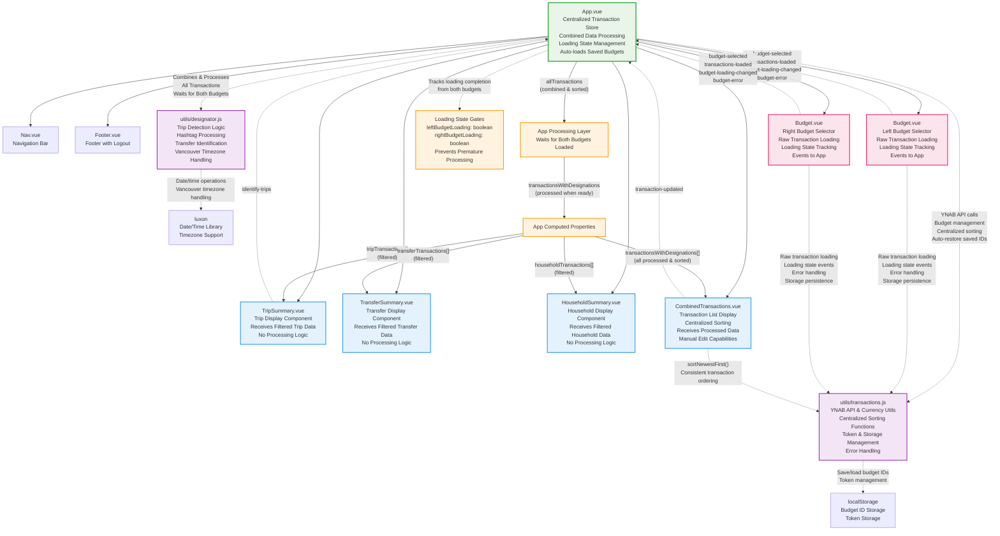

# Vue Component Data Hierarchy - Centralized Transaction Model



## Updated Centralized Data Model Architecture

### 🎯 **App.vue - Central Data Store with Proper Timing**
- **Raw Data Storage**: `leftTransactions[]`, `rightTransactions[]`
- **Loading State Tracking**: `leftBudgetLoading`, `rightBudgetLoading` (boolean flags)
- **Combined Processing**: `allTransactions` (computed) - merges both budgets with centralized sorting
- **Gated Processing**: `transactionsWithDesignations` (computed) - waits for both budgets to finish loading
- **Filtered Views**: Computed properties for each component type
- **Automatic Updates**: Watchers ensure summaries update when data changes

### 🔄 **Loading State Management**
```
Budget Selection → Loading Starts → API Call → Loading Complete → Process Designations
```

1. **Budget Components** emit `budget-loading-changed` events
2. **App tracks** both budget loading states
3. **Processing waits** until `!leftBudgetLoading && !rightBudgetLoading`
4. **Prevents premature** trip identification before all data is loaded

### 📊 **Enhanced Data Processing Pipeline**
```
Raw Transactions → Combined & Sorted → Loading Gate → Add Hashtags → Process Trips → Filter by Type → Components
```

1. **Budget Components** load raw transactions and emit loading state changes
2. **App combines** left + right transactions with centralized sorting from `transactions.js`
3. **Loading Gate** ensures both budgets are fully loaded before processing
4. **App processes** through designation utilities (hashtags, transfers, trips)
5. **App filters** into specific transaction types (trip, transfer, household)
6. **Summary Components** receive pre-filtered, processed data with consistent sorting

### 🔧 **Key Improvements**
- **Centralized Sorting**: All transaction sorting now handled by `sortingUtils` in `transactions.js`
- **Proper Loading Gates**: Uses Budget component loading flags instead of transaction count
- **Consistent Timing**: Trip Summary items only appear after all transactions are visible
- **Zero Transaction Support**: Handles budgets with legitimately zero transactions
- **Enhanced Events**: Budget components emit loading state changes for proper coordination

### 🎛️ **Transaction Sorting**
- **Primary Sort**: Date (newest first by default)
- **Secondary Sort**: Transaction ID (for consistency when dates match)
- **Centralized Logic**: Single `sortingUtils` used by both App and CombinedTransactions
- **Performance Optimized**: Pre-computed sort keys to avoid repeated date parsing
